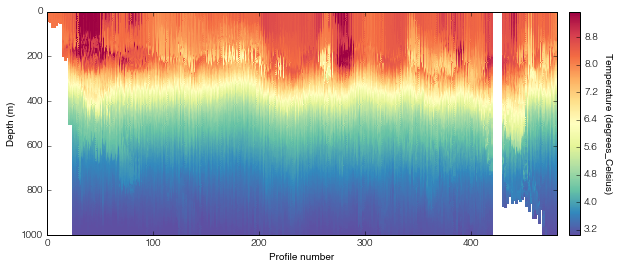
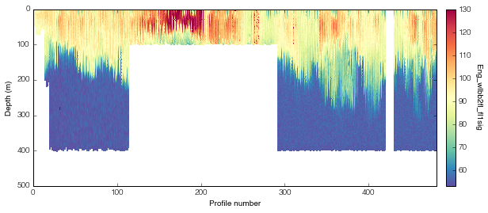

# SeaGlider-plotting

## Import the data 

The SeaGlider package takes the directory that contains all the netCDF files. The input string can also contain regular expression syntax as `glob` is used. Once the object has been imported you should be able to access all the variables that use `sg_data_point` as a dimension. This includes temperature, salinity, oxygen and a bunch of the ENG variables (press `TAB` after fullstop for autocomplete of all the variables — this will only work in *Jupyter notebook* or *IPython*)

    import SeaGlider_plotting_v01 as slg
    
    path_to_SG_data_dir = './sg542_data/'  # change this to the relevant directory
    sg542 = slg.SeaGlider(path_to_SG_data_dir, ref_file_name='./sg542_data/p5420100.nc')

## Working with a variable

The data is automatically interpolated to 1000m using 1m bins. The data is loaded and interpolated dynamically when a variable is called so it might take a while the first time. 

## Plotting
Simply call a variable (as below) and then plot section. `cmap` and `vlim` are optional arguments as shown in the second plot. The returned object is an axes object and all related methods can be used on these axes (as shown).

    sg542.temperature.plot_section()
    sg542.eng_wlbb2fl_FL1sig.plot_section(cmap=cm.Spectral_r)
	  

