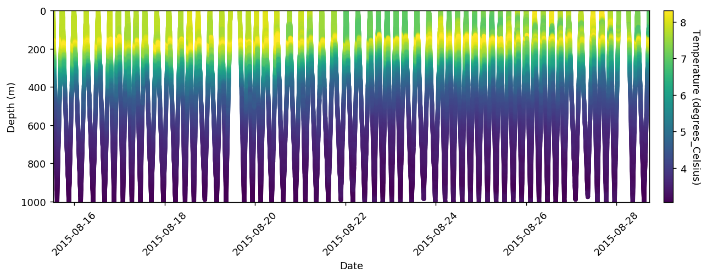
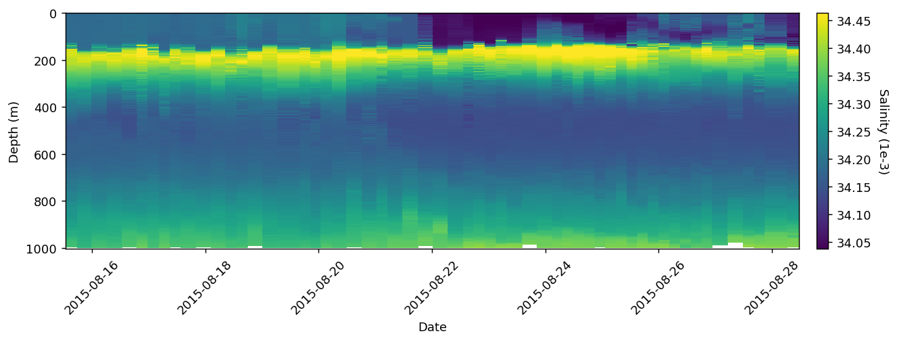
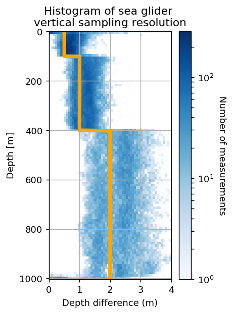

# Introduction

This is a demo of how to use the SeaGlider_utils package.

This package works best in Python 3.6 and works in 2.7 with limited plotting functionality.


**Package requirements:** 

- numpy
- pandas
- matplotlib
- netCDF4
- xarray
- tqdm
- seawater

# Table of Contents
 <p><div class="lev1 toc-item"><a href="#Introduction" data-toc-modified-id="Introduction-1"><span class="toc-item-num">1&nbsp;&nbsp;</span>Introduction</a></div><div class="lev1 toc-item"><a href="#Import-data" data-toc-modified-id="Import-data-2"><span class="toc-item-num">2&nbsp;&nbsp;</span>Import data</a></div><div class="lev1 toc-item"><a href="#Working-with-a-variable" data-toc-modified-id="Working-with-a-variable-3"><span class="toc-item-num">3&nbsp;&nbsp;</span>Working with a variable</a></div><div class="lev2 toc-item"><a href="#Accessing-Data" data-toc-modified-id="Accessing-Data-31"><span class="toc-item-num">3.1&nbsp;&nbsp;</span>Accessing Data</a></div><div class="lev2 toc-item"><a href="#View-all-loaded-data-with-dimension" data-toc-modified-id="View-all-loaded-data-with-dimension-32"><span class="toc-item-num">3.2&nbsp;&nbsp;</span>View all loaded data with <code>dimension</code></a></div><div class="lev2 toc-item"><a href="#Setting-a-column-as-a-dimension" data-toc-modified-id="Setting-a-column-as-a-dimension-33"><span class="toc-item-num">3.3&nbsp;&nbsp;</span>Setting a column as a dimension</a></div><div class="lev2 toc-item"><a href="#Reassigning-the-dimension-dictionary-(for-PAR)" data-toc-modified-id="Reassigning-the-dimension-dictionary-(for-PAR)-34"><span class="toc-item-num">3.4&nbsp;&nbsp;</span>Reassigning the dimension dictionary (for PAR)</a></div><div class="lev1 toc-item"><a href="#Plotting" data-toc-modified-id="Plotting-4"><span class="toc-item-num">4&nbsp;&nbsp;</span>Plotting</a></div><div class="lev1 toc-item"><a href="#Gridding-a-variable" data-toc-modified-id="Gridding-a-variable-5"><span class="toc-item-num">5&nbsp;&nbsp;</span>Gridding a variable</a></div>


```python
%pylab inline

from importlib import reload
import SeaGlider_utils as sgu

rcParams['figure.dpi'] = 130
```

    Populating the interactive namespace from numpy and matplotlib


# Import data 

The SeaGlider package takes the directory that contains all the netCDF files. The input string can also contain regular expression syntax as `glob` is used. Once the object has been imported you should be able to access all the variables that use `sg_data_point` as a dimension. This includes temperature, salinity, oxygen and a bunch of the ENG variables (press `TAB` after fullstop for autocomplete of all the variables — this will only work in *Jupyter notebook* or *IPython*)


```python
# change this to the relevant directory
path_to_SG_data_dir = '/Users/luke/Documents/SeaGliders/Data/Level_0/sg543/2015_Winter/p54301[0-5]*'  

reload(sgu)
sg542 = sgu.SeaGlider(path_to_SG_data_dir)
sg542
```


    Number of dives:  58
    Date range:       2015-08-15 12:08:43   to   2015-08-28 17:08:59
    Dimensions:       access these DataFrames in `.data[dim_name]`
                      • trajectory (1)
                      • gps_info (3)
                      • gc_event (23)
                      • sg_data_point (67)
                      • qsp2150_data_point (1)
    
    Access all variables directly from this object `.variable_name`
    [press TAB to autocomplete]


# Working with a variable

The data is automatically interpolated to 1000m using 1m bins. The data is loaded and interpolated dynamically when a variable is called so it might take a while the first time. 

## Accessing Data

You can also access the interpolated data using `SeaGlider_object.variable_name.data`, which returns a pandas.DataFrame, with `dims[depth, dive]`, where dives are split into up and down with whole numbers being down and `.5` being down


```python
sg542.temperature.data.head(10)  # head is a pd.DataFrame function that shows the first n entries
```

    100%|██████████| 58/58 [00:02<00:00, 24.41it/s]


<div>
<style>
    .dataframe thead tr:only-child th {
        text-align: right;
    }

    .dataframe thead th {
        text-align: left;
    }

    .dataframe tbody tr th {
        vertical-align: top;
    }
</style>
<table border="1" class="dataframe">
  <thead>
    <tr style="text-align: right;">
      <th></th>
      <th>temperature</th>
      <th>ctd_time</th>
      <th>longitude</th>
      <th>latitude</th>
      <th>ctd_depth</th>
      <th>dives</th>
    </tr>
  </thead>
  <tbody>
    <tr>
      <th>0</th>
      <td>7.833097</td>
      <td>2015-08-15 12:47:43.346</td>
      <td>8.617667</td>
      <td>-43.060967</td>
      <td>1.512745</td>
      <td>0.0</td>
    </tr>
    <tr>
      <th>1</th>
      <td>7.829159</td>
      <td>2015-08-15 12:47:51.386</td>
      <td>8.617687</td>
      <td>-43.060964</td>
      <td>1.692523</td>
      <td>0.0</td>
    </tr>
    <tr>
      <th>2</th>
      <td>7.832157</td>
      <td>2015-08-15 12:47:59.006</td>
      <td>8.617706</td>
      <td>-43.060962</td>
      <td>1.796471</td>
      <td>0.0</td>
    </tr>
    <tr>
      <th>3</th>
      <td>7.831517</td>
      <td>2015-08-15 12:48:06.926</td>
      <td>8.617726</td>
      <td>-43.060959</td>
      <td>2.062482</td>
      <td>0.0</td>
    </tr>
    <tr>
      <th>4</th>
      <td>7.831263</td>
      <td>2015-08-15 12:48:14.573</td>
      <td>8.617745</td>
      <td>-43.060957</td>
      <td>2.086036</td>
      <td>0.0</td>
    </tr>
    <tr>
      <th>5</th>
      <td>7.836698</td>
      <td>2015-08-15 12:48:22.507</td>
      <td>8.617749</td>
      <td>-43.060981</td>
      <td>2.452261</td>
      <td>0.0</td>
    </tr>
    <tr>
      <th>6</th>
      <td>7.828844</td>
      <td>2015-08-15 12:48:33.284</td>
      <td>8.617716</td>
      <td>-43.061000</td>
      <td>3.872457</td>
      <td>0.0</td>
    </tr>
    <tr>
      <th>7</th>
      <td>7.830206</td>
      <td>2015-08-15 12:48:41.248</td>
      <td>8.617703</td>
      <td>-43.061037</td>
      <td>5.481187</td>
      <td>0.0</td>
    </tr>
    <tr>
      <th>8</th>
      <td>7.828335</td>
      <td>2015-08-15 12:48:52.765</td>
      <td>8.617673</td>
      <td>-43.061105</td>
      <td>7.674948</td>
      <td>0.0</td>
    </tr>
    <tr>
      <th>9</th>
      <td>7.829207</td>
      <td>2015-08-15 12:48:58.468</td>
      <td>8.617646</td>
      <td>-43.061132</td>
      <td>8.212154</td>
      <td>0.0</td>
    </tr>
  </tbody>
</table>
</div>


```python
sg542.eng_wlbb2flvmt_Chlsig.load()
```

    100%|██████████| 58/58 [00:00<00:00, 207.24it/s]


## View all loaded data with `dimension`


```python
sg542.data['sg_data_point'].head(10)
```


<div>
<style>
    .dataframe thead tr:only-child th {
        text-align: right;
    }

    .dataframe thead th {
        text-align: left;
    }

    .dataframe tbody tr th {
        vertical-align: top;
    }
</style>
<table border="1" class="dataframe">
  <thead>
    <tr style="text-align: right;">
      <th></th>
      <th>temperature</th>
      <th>ctd_time</th>
      <th>longitude</th>
      <th>latitude</th>
      <th>ctd_depth</th>
      <th>dives</th>
      <th>eng_wlbb2flvmt_Chlsig</th>
    </tr>
  </thead>
  <tbody>
    <tr>
      <th>0</th>
      <td>7.833097</td>
      <td>2015-08-15 12:47:43.346</td>
      <td>8.617667</td>
      <td>-43.060967</td>
      <td>1.512745</td>
      <td>0.0</td>
      <td>94.0</td>
    </tr>
    <tr>
      <th>1</th>
      <td>7.829159</td>
      <td>2015-08-15 12:47:51.386</td>
      <td>8.617687</td>
      <td>-43.060964</td>
      <td>1.692523</td>
      <td>0.0</td>
      <td>93.0</td>
    </tr>
    <tr>
      <th>2</th>
      <td>7.832157</td>
      <td>2015-08-15 12:47:59.006</td>
      <td>8.617706</td>
      <td>-43.060962</td>
      <td>1.796471</td>
      <td>0.0</td>
      <td>94.0</td>
    </tr>
    <tr>
      <th>3</th>
      <td>7.831517</td>
      <td>2015-08-15 12:48:06.926</td>
      <td>8.617726</td>
      <td>-43.060959</td>
      <td>2.062482</td>
      <td>0.0</td>
      <td>62.0</td>
    </tr>
    <tr>
      <th>4</th>
      <td>7.831263</td>
      <td>2015-08-15 12:48:14.573</td>
      <td>8.617745</td>
      <td>-43.060957</td>
      <td>2.086036</td>
      <td>0.0</td>
      <td>95.0</td>
    </tr>
    <tr>
      <th>5</th>
      <td>7.836698</td>
      <td>2015-08-15 12:48:22.507</td>
      <td>8.617749</td>
      <td>-43.060981</td>
      <td>2.452261</td>
      <td>0.0</td>
      <td>86.0</td>
    </tr>
    <tr>
      <th>6</th>
      <td>7.828844</td>
      <td>2015-08-15 12:48:33.284</td>
      <td>8.617716</td>
      <td>-43.061000</td>
      <td>3.872457</td>
      <td>0.0</td>
      <td>93.0</td>
    </tr>
    <tr>
      <th>7</th>
      <td>7.830206</td>
      <td>2015-08-15 12:48:41.248</td>
      <td>8.617703</td>
      <td>-43.061037</td>
      <td>5.481187</td>
      <td>0.0</td>
      <td>91.0</td>
    </tr>
    <tr>
      <th>8</th>
      <td>7.828335</td>
      <td>2015-08-15 12:48:52.765</td>
      <td>8.617673</td>
      <td>-43.061105</td>
      <td>7.674948</td>
      <td>0.0</td>
      <td>92.0</td>
    </tr>
    <tr>
      <th>9</th>
      <td>7.829207</td>
      <td>2015-08-15 12:48:58.468</td>
      <td>8.617646</td>
      <td>-43.061132</td>
      <td>8.212154</td>
      <td>0.0</td>
      <td>92.0</td>
    </tr>
  </tbody>
</table>
</div>


## Setting a column as a dimension


```python
sg542.data['gc_event'].coordinates = ['gc_depth']
sg542.gc_pitch_ctl.data.head(10)
```

    100%|██████████| 58/58 [00:00<00:00, 182.46it/s]


<div>
<style>
    .dataframe thead tr:only-child th {
        text-align: right;
    }

    .dataframe thead th {
        text-align: left;
    }

    .dataframe tbody tr th {
        vertical-align: top;
    }
</style>
<table border="1" class="dataframe">
  <thead>
    <tr style="text-align: right;">
      <th></th>
      <th>gc_pitch_ctl</th>
      <th>gc_depth</th>
      <th>dives</th>
    </tr>
  </thead>
  <tbody>
    <tr>
      <th>0</th>
      <td>-0.54</td>
      <td>0.0</td>
      <td>0.0</td>
    </tr>
    <tr>
      <th>1</th>
      <td>-0.60</td>
      <td>3.1</td>
      <td>0.0</td>
    </tr>
    <tr>
      <th>2</th>
      <td>-0.57</td>
      <td>13.8</td>
      <td>0.0</td>
    </tr>
    <tr>
      <th>3</th>
      <td>-0.49</td>
      <td>25.5</td>
      <td>0.0</td>
    </tr>
    <tr>
      <th>4</th>
      <td>-0.49</td>
      <td>53.3</td>
      <td>0.0</td>
    </tr>
    <tr>
      <th>5</th>
      <td>-0.49</td>
      <td>108.5</td>
      <td>0.0</td>
    </tr>
    <tr>
      <th>6</th>
      <td>-0.49</td>
      <td>126.3</td>
      <td>0.0</td>
    </tr>
    <tr>
      <th>7</th>
      <td>-0.49</td>
      <td>178.2</td>
      <td>0.0</td>
    </tr>
    <tr>
      <th>8</th>
      <td>-0.49</td>
      <td>224.6</td>
      <td>0.0</td>
    </tr>
    <tr>
      <th>9</th>
      <td>-0.51</td>
      <td>265.6</td>
      <td>0.0</td>
    </tr>
  </tbody>
</table>
</div>


## Reassigning the dimension dictionary (for PAR)


```python
sg542.ctd_pressure.load()  # load ctd_pressure as a dummy to load coordinates
sg542.eng_qsp_PARuV.__data__ = sg542.data['sg_data_point']
sg542.eng_qsp_PARuV.data.head(10)
```

    100%|██████████| 58/58 [00:00<00:00, 195.10it/s]
    100%|██████████| 58/58 [00:00<00:00, 228.71it/s]


<div>
<style>
    .dataframe thead tr:only-child th {
        text-align: right;
    }

    .dataframe thead th {
        text-align: left;
    }

    .dataframe tbody tr th {
        vertical-align: top;
    }
</style>
<table border="1" class="dataframe">
  <thead>
    <tr style="text-align: right;">
      <th></th>
      <th>eng_qsp_PARuV</th>
      <th>ctd_time</th>
      <th>longitude</th>
      <th>latitude</th>
      <th>ctd_depth</th>
      <th>dives</th>
    </tr>
  </thead>
  <tbody>
    <tr>
      <th>0</th>
      <td>0.839</td>
      <td>2015-08-15 12:47:43.346</td>
      <td>8.617667</td>
      <td>-43.060967</td>
      <td>1.512745</td>
      <td>0.0</td>
    </tr>
    <tr>
      <th>1</th>
      <td>0.437</td>
      <td>2015-08-15 12:47:51.386</td>
      <td>8.617687</td>
      <td>-43.060964</td>
      <td>1.692523</td>
      <td>0.0</td>
    </tr>
    <tr>
      <th>2</th>
      <td>0.549</td>
      <td>2015-08-15 12:47:59.006</td>
      <td>8.617706</td>
      <td>-43.060962</td>
      <td>1.796471</td>
      <td>0.0</td>
    </tr>
    <tr>
      <th>3</th>
      <td>0.513</td>
      <td>2015-08-15 12:48:06.926</td>
      <td>8.617726</td>
      <td>-43.060959</td>
      <td>2.062482</td>
      <td>0.0</td>
    </tr>
    <tr>
      <th>4</th>
      <td>0.804</td>
      <td>2015-08-15 12:48:14.573</td>
      <td>8.617745</td>
      <td>-43.060957</td>
      <td>2.086036</td>
      <td>0.0</td>
    </tr>
    <tr>
      <th>5</th>
      <td>0.736</td>
      <td>2015-08-15 12:48:22.507</td>
      <td>8.617749</td>
      <td>-43.060981</td>
      <td>2.452261</td>
      <td>0.0</td>
    </tr>
    <tr>
      <th>6</th>
      <td>0.409</td>
      <td>2015-08-15 12:48:33.284</td>
      <td>8.617716</td>
      <td>-43.061000</td>
      <td>3.872457</td>
      <td>0.0</td>
    </tr>
    <tr>
      <th>7</th>
      <td>0.411</td>
      <td>2015-08-15 12:48:41.248</td>
      <td>8.617703</td>
      <td>-43.061037</td>
      <td>5.481187</td>
      <td>0.0</td>
    </tr>
    <tr>
      <th>8</th>
      <td>0.414</td>
      <td>2015-08-15 12:48:52.765</td>
      <td>8.617673</td>
      <td>-43.061105</td>
      <td>7.674948</td>
      <td>0.0</td>
    </tr>
    <tr>
      <th>9</th>
      <td>0.356</td>
      <td>2015-08-15 12:48:58.468</td>
      <td>8.617646</td>
      <td>-43.061132</td>
      <td>8.212154</td>
      <td>0.0</td>
    </tr>
  </tbody>
</table>
</div>


# Plotting
Simply call a variable (as below) and then plot section. `cmap` and `vlim` are optional arguments as shown in the second plot. The returned object is an axes object and all related methods can be used on these axes (as shown).


```python
sg542.temperature.scatter()
```


    <matplotlib.axes._subplots.AxesSubplot at 0x118eef358>





```python
sg542.salinity.pcolormesh(interpolated=False)
```

    100%|██████████| 58/58 [00:00<00:00, 177.61it/s]


    <matplotlib.axes._subplots.AxesSubplot at 0x118e4f860>





# Gridding a variable

1. Check the resolution you should be binning at using `sgu.plotting.depth_binning`
2. Create an appropriate bins array using `np.r_[np.arange(), np.arange()]`
3. Bin the data with `sg.variable.bin_depths(bins=bins)`
4. The gridded data can be accessed from `sg.variable.gridded`


```python
bins = np.r_[
    np.arange(0, 100, 0.5),
    np.arange(100, 400, 1),
    np.arange(400, 1000, 2)
]

depth = sg542.ctd_depth.data.ctd_depth
sgu.plotting.depth_binning(depth, bins=bins)
```


    <matplotlib.axes._subplots.AxesSubplot at 0x117c4d1d0>





```python
sg542.salinity.bin_depths(bins=bins)
sg542.salinity.gridded.iloc[10:15, 10:15]
```


<div>
<style>
    .dataframe thead tr:only-child th {
        text-align: right;
    }

    .dataframe thead th {
        text-align: left;
    }

    .dataframe tbody tr th {
        vertical-align: top;
    }
</style>
<table border="1" class="dataframe">
  <thead>
    <tr style="text-align: right;">
      <th>ctd_time</th>
      <th>2015-08-17 19:56:03.484000</th>
      <th>2015-08-18 02:25:14.309000</th>
      <th>2015-08-18 08:39:04.504000</th>
      <th>2015-08-18 13:24:13.259000</th>
      <th>2015-08-18 17:51:06.007000</th>
    </tr>
    <tr>
      <th>ctd_depth</th>
      <th></th>
      <th></th>
      <th></th>
      <th></th>
      <th></th>
    </tr>
  </thead>
  <tbody>
    <tr>
      <th>5.75</th>
      <td>34.184507</td>
      <td>34.184625</td>
      <td>34.225211</td>
      <td>34.221691</td>
      <td>34.220978</td>
    </tr>
    <tr>
      <th>6.25</th>
      <td>34.186180</td>
      <td>34.185060</td>
      <td>34.203421</td>
      <td>NaN</td>
      <td>34.199451</td>
    </tr>
    <tr>
      <th>6.75</th>
      <td>34.183891</td>
      <td>NaN</td>
      <td>NaN</td>
      <td>34.220424</td>
      <td>NaN</td>
    </tr>
    <tr>
      <th>7.25</th>
      <td>NaN</td>
      <td>34.183362</td>
      <td>34.222716</td>
      <td>34.223012</td>
      <td>34.201600</td>
    </tr>
    <tr>
      <th>7.75</th>
      <td>34.186002</td>
      <td>34.183736</td>
      <td>34.222070</td>
      <td>34.221112</td>
      <td>NaN</td>
    </tr>
  </tbody>
</table>
</div>


```python

```
